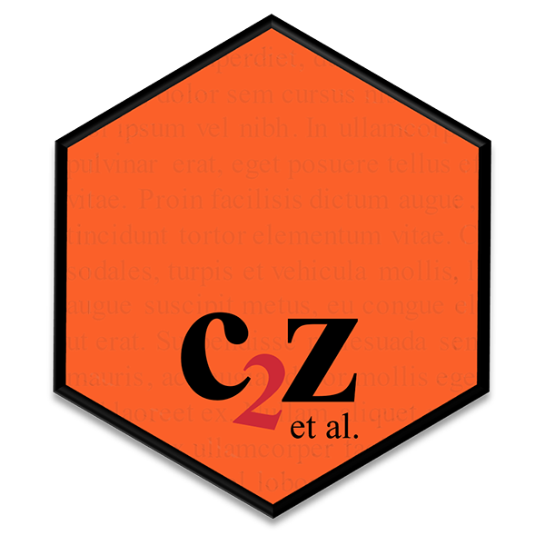
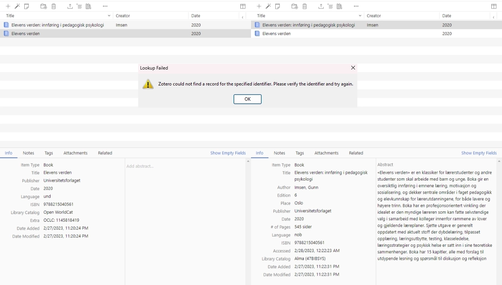

<!-- README.md is generated from README.Rmd. Please edit that file -->

# *c2z*: a Reference Manager in *R*

<p align="center">
<a 
href="https://oeysan.github.io/c2z/reference/figures/badge.webp" 
id="logo" title="Logo">
 </a>
</p>
<p align="center">
<a href="https://oeysan.github.io/c2z/news/index.html" id="news" 
title="News"></a><br/><a 
href="https://cran.r-project.org/package=c2z" id="cran" 
title="CRAN Version"></a>
<a href="https://github.com/oeysan/c2z" id="github" 
title="GitHub Version"></a>
<br/><a href="https://oeysan.github.io/c2z/LICENSE.html" id="license" 
title="License">
</a> <a href="https://github.com/oeysan/c2z/actions" 
id="rcmdcheck" title="Build Status"></a>
</p>

# 

## What is *c2z* (Cristin to Zotero)?

The observant reader has already identified the brilliant word play on
Psalm 72:8 (King James Version): “He shall have dominion also from **sea
to sea**, and from the river unto the ends of the earth”. *`c2z`* aims
at obtaining total dominion over [Cristin](https://app.cristin.no/)
(Current Research Information SysTem in Norway) and
[Zotero](https://www.zotero.org/). The package enables manipulating
Zotero libraries using [*R*](https://www.r-project.org/). Import, in
batch, references from Cristin, regjeringen.no, CRAN, ISBN (currently,
Alma and Library of Congress), and DOI (currently, CrossRef and
DataCite) to a Zotero library. Add, edit, copy, or delete items,
including attachments and collections, and export references to BibLaTeX
(and other formats) directly in *R* (see Figure 1).

<p align="center">
<a href="https://oeysan.github.io/c2z/reference/figures/flowchart.svg">

</a>
</p>

*Figure 1.* *c2z* flowchart.

### Who would want to use *c2z*?

Anyone using Zotero, or similar reference management software. However,
the project is probably of extra interest to researchers, students,
bibliomaniacs and others working in library-type services. Though the
project is grounded in a Norwegian context (with apologizes to Åse Wetås
for writing the documentation in (American) English), international
publications are easily available through DOI and ISBN, and the Zotero
functions are independent of acquiring metadata from external services.

Should you require a specific international/national/regional library or
database, please make a request
[here](https://github.com/oeysan/c2z/issues/) or open a [pull
request](https://github.com/oeysan/c2z/pulls). The only requirement is
that the library services have open access and serve MARC 21 / DOI type
metadata (or has fairly structured XML/JSON). Okay, okay, there are no
requirements, I’ll look into any request and try to make it work.

### What can you use *c2z* for?

Hoarding references in Zotero, obviously. However, *`c2z`* also has more
practical purposes, especially in combination with other packages. You
are probably the right kind of weirdo (since you are reading this) and
you could use *`c2z`* to easily handle your references while writing and
preparing manuscripts (e.g., [papaja](https://github.com/crsh/papaja)),
or for use on a (personal) webpage (e.g.,
[blogdown](https://github.com/rstudio/blogdown) or
[bookdown](https://github.com/rstudio/bookdown)). If you need to work
for a living, or just like to show off, you could automate the
publication list for your résumé (e.g.,
[vitae](https://github.com/mitchelloharawild/vitae)). If the Man pays
you to keep track of publications, you could schedule a script (e.g.,
[cronR](https://github.com/bnosac/cronR),
[taskscheduleR](https://github.com/bnosac/taskscheduleR) or Github
Actions) to keep track of new publications from an institution or
research group and email you (or the Man) recent publications on a
monthly or weekly (or hourly) basis (e.g.,
[emayili](https://github.com/datawookie/emayili/) or
[mailR](https://github.com/rpremrajGit/mailR)). If you really feel like
it you could use [Home
Assistant](https://developers.home-assistant.io/docs/api/rest/) to play
[Tina Turner - The Best (Official Music
Video)](https://www.youtube.com/watch?v=GC5E8ie2pdM) whenever one of
your publications is registered on Cristin.

**The sky is the limit!**

## List of current features

- Add, edit, copy, and delete (nested) Zotero collections.
- Add, edit, copy, and delete Zotero items, including attachments.
- Export Zotero items in *R* as BibLaTeX (and other formats).
- Batch import common references from Cristin.
  - Currently supported formats: books (e.g., anthologies), book
    chapters, journal articles, presentations (e.g., lectures), and
    opinions pieces.
- Batch import references from ISBN and DOI.
  - Currently supported formats (CrossRef\`): books, book chapters,
    conference papers, journal articles.
  - DataCite references are treated as preprints and stores reference
    type (.e.g, dataset) as Genre.
- Batch import Norwegian white papers and official Norwegian reports.
- Batch import *R* packages from CRAN.
- Search CrossRef, automatically and manually, by author(s), title, and
  year.
- Augment Cristin references through ISBN, DOI, or CrossRef search.
- Create month-to-month newsletter for registered publications in
  Cristin.

## Dependencies

The project strives at keeping the number of dependencies at a minimum.
However, *`c2z`* is highly dependent on
[dplyr](https://github.com/tidyverse/dplyr),
[httr](https://github.com/r-lib/httr),
[purrr](https://github.com/tidyverse/purrr),
[rvest](https://github.com/tidyverse/rvest),
[tibble](https://github.com/tidyverse/tibble), and
[jsonlite](https://github.com/jeroen/jsonlite).

Dependencies are automatically installed from CRAN. By default, outdated
dependencies are automatically upgraded.

## Installing

You probably want to access a restricted Zotero library. Please see [the
short tutorial](https://oeysan.github.io/c2z/articles/zotero_api.html)
on how to create a Zotero API key and how to define it in your
`.Renviron`.

You can install *`c2z`* from GitHub. If you already have a previous
version of *`c2z`* installed, using the command below will update to the
latest development version.

#### Development version ([GitHub](https://github.com/oeysan/c2z/))

``` r
devtools::install_github("oeysan/c2z")
```

Please note that stable versions are hosted at CRAN, whereas GitHub
versions are in active development.

#### Stable version ([CRAN](https://CRAN.R-project.org/package=c2z))

``` r
utils::install.packages("c2z")
```

## Example

Also, please see the [magnificent
vignette](https://oeysan.github.io/c2z/articles/c2z_vignette.html) and
other [documentation](https://oeysan.github.io/c2z/).

I work as an associate professor at a department of teacher education in
Norway. Doing so, one of my responsibilities is surprisingly enough
teaching. Even more surprising, most of the literature is in Norwegian,
and in the form of monographs or anthologies. Unfortunately, Zotero is
not well-adapted to importing Norwegian books through ISBN (see Figure
2). In the example below, Imsen (2020) is imported using the Zotero
magic wand (left) and *`c2z`* (right). Similarly, Zotero is unable to
import Johannessen et al. (2021) using ISBN (cf. lookup failed).
Evidently, Alma (47BIBSYS) is superior to Open WorldCat and similar when
it comes to identifying (most) Norwegian books.

<p align="center">
<a href="https://oeysan.github.io/c2z/reference/figures/readme_imsen.webp">
</a>
</p>

*Figure 2.* Zotero vs. *c2z* example.

The following example of *`c2z`* addresses this issue, and the `Zotero`
function act as a wrapper by 1) connecting to the Zotero API, 2)
creating a collection called “c2z-example”, 3) search for items using
two ISBN identifiers (i.e. Imsen, 2020; Johannessen et al., 2021), 4)
posting the items to the defined collection, 5) and creating a
bibliography in HTML format using the APA7 reference style (could also
be exported) to any supported Zotero export (e.g., BibLaTeX), and 6)
cleaning up the example by deleting the collection and the two items.
The *R* output is rather noisy and can be disabled by adding
`silent = TRUE`.

``` r
library(c2z)
example <- Zotero(
  collection.names = "c2z-example",
  library = TRUE,
  library.type = "data,bib",
  create = TRUE,
  isbn = c("9788215040561", "9788279354048"),
  post = TRUE,
  post.collections = FALSE,
  style = "apa-single-spaced",
  delete = TRUE,
  delete.collections = TRUE,
  delete.items = TRUE,
  index = TRUE
)
#> Searching for collections 
#> Found 0 collections 
#> Adding 1 collection to library using 1 POST request 
#> —————————————————Process: 100.00% (1/1). Elapsed time: 00:00:00—————————————————
#> $post.status.collections
#> # A tibble: 1 × 2
#>   status  key     
#>   <fct>   <chr>   
#> 1 success HARIMH4Z
#> 
#> $post.summary.collections
#> # A tibble: 1 × 2
#>   status  summary
#>   <fct>     <int>
#> 1 success       1
#> 
#> 
#> The Zotero list contains: 1 collection, 0 items, and 0 attachments 
#> Searching 2 items using ISBN 
#> Adding 2 items to library using 1 POST request 
#> NULL
#> 
#> Searching for items using 1 collection 
#> Found 0 items 
#> The Zotero list contains: 1 collection, 2 items, and 0 attachments 
#> Deleting 1 collection using 1 DELETE request 
#> —————————————————Process: 100.00% (1/1). Elapsed time: 00:00:00—————————————————
#> Deleting 2 items using 1 DELETE request 
#> —————————————————Process: 100.00% (1/1). Elapsed time: 00:00:00—————————————————
#> Creating index for items
```

The example will yield the following HTML output:

<div style="font-size:80%; width: 80%; margin: 10px auto; border: 2px solid green; 
padding: 5px;">

</div>

Johannessen et al. (2021) is an interesting (well, perhaps not
interesting to all people) example of the nasty business that is
metadata. In Cristin the authors are listed as *Christoffersen,
Johannessen, and Tufte*, in Alma the authors are listed as *Johannessen,
Christoffersen, and Tufte*, whereas the book itself list the authors as
*Johannessen, Tufte, and Christoffersen* (interesting, right?). *`c2z`*
amends the conflicting results provided by Cristin and Alma by parsing
the statement of responsibility field (if it exists) in MARC 21.

## Limitations

Despite several innovative, creative and valiant efforts to mitigate
common weaknesses in CrossRef, DataCite, MARC 21, and especially
Cristin, *`c2z`* cannot always create order in a chaotic metadata world.
A major limitation of any reference management software scraping
metadata through databases is poorly registered data.
[GIGO](https://en.wikipedia.org/wiki/Garbage_in,_garbage_out) will
happen and manual inspection is required to assure that the references
are correct.

Moreover, the project stands or falls by its relationship with the
API’s, meaning that *`c2z`* is likely a high maintenance project. For
instance, Cris/NVA is planned to replace Cristin during 2023, which is
likely to cause some headache.

Finally (not really, there are probably several other limitations),
*`c2z`* is not built for speed. The project tries to wrangle data from
strange and exotic beasts, while simultaneously hoping to avoid
exploding kittens. Isolated, wrangling data from Cristin, ISBN, or DOI
is not very time-consuming (though downloading the entire Cristin
database (\> 300 MB) and importing to Zotero will take some time). One
reason is that Cristin for some reason keeps a separate table containing
contributors, meaning that each reference needs two API calls. Book
chapters are even more time-consuming, as Cristin also keeps the book
metadata in another table, totaling four (4) API calls.

Enabling data-augmentation through DOI or ISBN demands even more API
calls, and if Crossref search is enabled, with no prior identification
through DOI or ISBN, the process can take a long, long time. (… and
totally hammer the Crossref API, please don’t do it!). For example,
downloading and converting 50 random items (*n* = 1600) from each of
the, for now, supported Cristin categories (*k* = 32), takes
approximately 3.12 minutes without any augmentation, 39.02 minutes with
DOI/ISBN look-up, and 177.54 minutes with Crossref search enabled.
Please note that run-time is dependent on bandwidth and the
response-time for the API’s (Alma has especially high latency), and that
*`c2z`* uses exponential backoff depending on the API response.

Please report any bugs/issues/requests
[here](https://github.com/oeysan/c2z/issues/), and feel free to make a
[pull request](https://github.com/oeysan/c2z/pulls).

## Coding conventions

Your *R* code seems to be a mash-up of different styles, not adhering to
[Google’s *R* style
guide](https://google.github.io/styleguide/Rguide.html) or [Tidyverse’s
style guide](https://style.tidyverse.org/). In addition, you combine
both HTML/CSS/JS and Markdown, violating the [Markdown
philosophy](https://daringfireball.net/projects/markdown/syntax#philosophy).
What’s your thought on this breach of tradition?

– [“Thank you, but I prefer it my
way.”](https://www.youtube.com/watch?v=EsXjzkXVuFc)

## Code of conduct

Don’t be evil. Please read the [Code of
Conduct](https://oeysan.github.io/c2z/CONDUCT.html)

## License

This project is licensed under the MIT License - see
[LICENSE](https://oeysan.github.io/c2z/LICENSE.html) for details

## Acknowledgments

Henrik Karlstrøm for his work on
[rcristin](https://github.com/henrikkarlstrom/rcristin)
