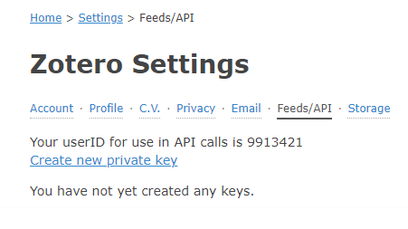
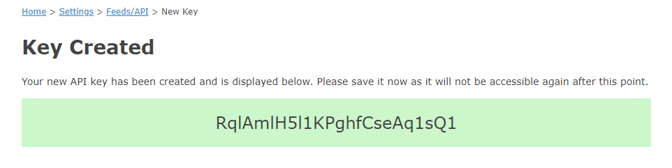

```{r, include = FALSE}
knitr::opts_chunk$set(
  collapse = TRUE,
  comment = "#>"
)
```

```{r setup}
library(c2z)
```

Also, please see the [magnificent vignette](articles/c2z_vignette.html) and 
other [documentation](https://oeysan.github.io/c2z/).

## Step 1: Locate Zotero settings

A likely purpose of using `c2z` is to manipulate a (personal) Zotero library. 
Thus, the first step is to acquire an access key for your account, which
you will find in the [settings](https://www.zotero.org/settings/keys/). As 
seen from the screenshot below, this is also where you can find your `userID`.



## Step 2: Create a key

Next, enter a key description and decide what kind of access you will need. A 
bare minimum is to "allow library access", however, if you want to create,
edit, copy, or delete items you will need to "allow write access" as well. You
can also add group permissions. Now that you have created a key, as seen below, 
you will need to make it available to *`c2z`*.

{width=80%}

## Step 3: Add key to *R*

Though it is possible to directly apply the key in the various functions, it 
is recommended to add the key to the `.Renviron`. The simplest approach is to
use the [usethis](https://usethis.r-lib.org/reference/edit.html) 
`edit_r_environ()` function, that will open the file for your convenience. 


```{r r_environ, eval = FALSE}
usethis::edit_r_environ()
```


## How it works

```{r r.environ, eval = TRUE}
# Access default zotero library
user.library <- Zotero(library = TRUE)
# Print type of library and id
sprintf("The library has the prefix: %s", user.library$prefix)

# Access the group zotero library
group.library <- Zotero(user = FALSE, library = TRUE, silent = TRUE)
# Print type of library and id
sprintf("The library has the prefix: %s", group.library$prefix)

# Print the API
sprintf("The API key for these libraries is: %s", Sys.getenv("ZOTERO_API"))

```
